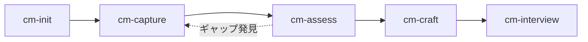

[English](../README.md) | [简体中文](README.zh-CN.md) | **日本語** | [한국어](README.ko.md)

# career-mind

[](LICENSE) [](../.claude-plugin/marketplace.json)

AI コーディングエージェント向けキャリア能力管理ツール。あらゆるソースから能力情報を収集し、情報品質を評価し、あらゆるシナリオに対応するキャリア成果物を生成——履歴書、パフォーマンスレビュー、昇進ケースなど。

> **架空の実績はありません。** すべての出力は実際の経験に遡って追跡可能です。

---

## クイックスタート

```bash
git clone https://github.com/ClawEnable/career-mind.git
cp -r career-mind/skills/* ~/.claude/skills/   # またはエージェントのスキルパス
```

エージェントで `/career-mind:cm-init` を実行して開始します。

---

## 特徴

### 出力と品質

- **マルチシナリオ出力** — 履歴書、CV、パフォーマンスレビュー、昇進ケース、スキルマップなど
- **反復品質ループ** — 評価がギャップを発見、キャプチャが自動補完

### 信頼と移植性

- **反捏造** — すべての出力項目は `.meta.md` ソースマッピングで検証済み証拠に追溯可能
- **ゼロ依存** — 純粋なプロンプトエンジニアリング；ビルドツール不要、APIキー不要、オフライン動作

### 適応とクロスプラットフォーム

- **キャリアステージ対応** — 新卒、ミドルキャリア、シニア、キャリアチェンジそれぞれに戦略を適応
- **5+ エージェントプラットフォーム** — Claude Code、Codex、Cursor、OpenCode、OpenClaw

---

## 対応エージェント

| エージェント | スキルパス | インストール方法 |
|-------------|-----------|----------------|
| Claude Code | `~/.claude/skills/` | プラグインマーケットプレイスまたは手動コピー |
| Codex | `~/.agents/skills/` | `$skill-installer` または手動コピー |
| Cursor | `~/.agents/skills/` または `~/.cursor/skills/` | GitHub リモートインポートまたは手動コピー |
| OpenCode | `.opencode/skills/` | 手動コピー |
| OpenClaw | `<workspace>/skills/` | `openclaw skills install` |

---

## インストール

### Claude Code

プラグインマーケットプレイス（推奨）：

```
/plugin marketplace add ClawEnable/career-mind
/plugin install career-mind@career-mind
```

または手動：

```bash
git clone https://github.com/ClawEnable/career-mind.git
cp -r career-mind/skills/* ~/.claude/skills/
```

### OpenClaw

```bash
openclaw skills install career-mind
```

### その他のエージェント

`skills/` ディレクトリをエージェントのスキルパスにコピー（上記の表を参照）：

```bash
git clone https://github.com/ClawEnable/career-mind.git
cp -r career-mind/skills/* ~/.agents/skills/   # Codex、Cursor、OpenCode
```

---

## スキル一覧

| コマンド | 説明 |
|---------|------|
| `/career-mind:cm-init` | キャリアコンテキストの初期化——ドキュメントスキャン、プロフィール収集、既存資料のインポート |
| `/career-mind:cm-capture` | ドメイン認識によるオプション形式の対話で能力を収集：インポート後分析、能動的記述、セッションレビュー、ドキュメントインポート |
| `/career-mind:cm-assess` | 情報品質を評価し、診断的インサイトと実行可能な推奨事項を提供 |
| `/career-mind:cm-craft` | キャリア成果物の生成：履歴書、パフォーマンスレビュー、昇進ケース、スキルマップ |
| `/career-mind:cm-interview` | 面接対策：技術、行動、コラボレーション問題、構造化モック面接 |
| `/career-mind:cm-status` | 現在のステータスを確認し、次のステップの推奨を取得 |

---

## 仕組み

プラグインは経験豊富な専門家向けに設計されたドメインファーストのインタラクションモデルを採用：

- **ドメイン推論**——質問する前に技術内容を理解するため、一般的な実践の説明を求めることはありません
- **オプションベースのキャプチャ**——推定値付きの洗練された記述オプションを生成し、ゼロから作成するのではなく確認または修正
- **アドバイザリー推奨**——選択肢を提示するだけでなく、理由付きで推奨
- **キャリアステージ適応**——キャリアステージに基づいて戦略を調整：新卒、ミドルキャリア、シニア、キャリアチェンジ
- **動的パースペクティブ**——ターゲット役割に応じて分析を調整；アーキテクトにとって重要なギャップがシニアエンジニアには軽微な場合も
- **反復的精製**——各選択が新しい手がかりを明らかにし、構造化されたラウンドを通じて正確な記述に収束



ニーズに応じてどこからでも開始：

- 何もない → `/career-mind:cm-init`
- 経験を記述したい → `/career-mind:cm-capture`
- 既存の内容を評価したい → `/career-mind:cm-assess`
- 特定の成果物が必要 → `/career-mind:cm-craft`
- 面接対策をしたい → `/career-mind:cm-interview`
- わからない → `/career-mind:cm-status`

---

## データとプライバシー

すべてのデータは現在の作業ディレクトリの `.career/` に保存：

```
.career/
├── profile.md       # 氏名、連絡先、学歴（継続的に拡充可能）
├── context.md       # スキル間状態（YAML frontmatter）
├── entries/         # 能力ライブラリ（project、signal、achievement エントリ）
└── outputs/         # 生成された成果物（履歴書、評価レポートなど）
```

**すべての個人データはプロジェクトディレクトリの `.career/` に保存されます。** プロフィール、エントリ、生成された成果物は、明示的に共有しない限りローカルマシンから出ることはありません。Git で追跡したくない場合は `.career/` を `.gitignore` に追加してください。

---

## 反捏造

プラグインは厳格なソース追跡を適用：

- `/career-mind:cm-craft` で生成された各成果物の箇条書きは検証済みソースに追跡可能（別の `.meta.md` ファイルに記録）
- ソースは限定：エントリライブラリ、プロフィールデータ、またはユーザーの直接の言葉
- 架空の指標、誇張されたスキル、捏造された実績はありません
- 修飾コンテキストは実績と共に保持——証拠を選択的に提示して認知される範囲を膨らませることはありません

---

## コントリビュート

スキル、評価ディメンション、出力シナリオの追加については [CONTRIBUTING.md](../CONTRIBUTING.md) を参照してください。

---

## ライセンス

[MIT](../LICENSE) © 2026 ClawEnable
